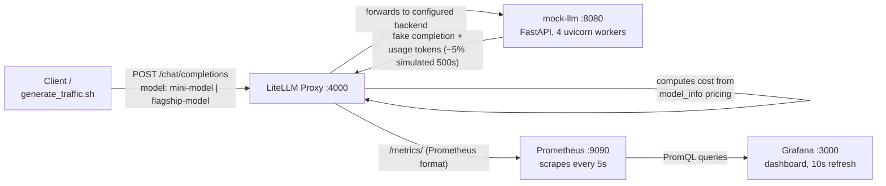

# LLM Cost & Observability Stack

**Repo:** `llm-cost-observability` (local: `~/personal-git/llm-cost-observability`)

**One-liner:** A FinOps dashboard for LLM API usage — the same
cost-attribution-by-tag pattern used for AWS spend, applied to "which model
tier is burning money" instead of "which service/team is burning money."

## Why this exists

Most public LLMOps/cost content comes from ML engineers. The angle here is
the infra/DevOps one: LLM API spend is untracked in most orgs the same way
AWS spend was before tagging discipline — nobody notices until the bill
arrives. This project reuses an existing skill set (Prometheus/Grafana,
cost-attribution thinking from the AWS cost reduction work) and points it at
a new target (LLM spend) rather than learning an unrelated stack from
scratch.

## Architecture



**Text version, if the diagram doesn't render:**

```
generate_traffic.sh
        |
        v
  LiteLLM proxy (:4000)  <-- config.yaml: model_name -> backend + pricing
        |
        v
  mock-llm (:8080)  -- fake OpenAI-compatible chat completions endpoint
        |
        v (response + token usage)
  LiteLLM computes cost, emits Prometheus metrics
        |
        v
  Prometheus (:9090)  -- scrapes /metrics/ every 5s
        |
        v
  Grafana (:3000)  -- 8-panel dashboard, PromQL queries via datasource proxy
```

## Components, in depth

### 1. `mock-llm` — the fake backend
A minimal FastAPI app (`mock-llm/app.py`) that mimics OpenAI's
`/v1/chat/completions` endpoint: it sleeps 0.2–1.2s to simulate inference
latency, computes token counts from a rough word-count heuristic, returns one
of a handful of canned replies, and randomly (~5% of requests) returns a 500
to simulate an upstream failure. Runs behind 4 Uvicorn workers — with only 1
worker, concurrent requests queued and inflated the latency metrics with wait
time rather than actual service time (this was a real bug hit while
building it — see **Debugging notes** below).

**Why a mock instead of a real provider:** zero API keys, zero real spend,
runs fully offline. Nothing about the observability layer downstream cares
what's behind LiteLLM — swapping this for real OpenAI/Anthropic/Bedrock is a
one-line change to `api_base` in LiteLLM's config, nothing else changes.

### 2. LiteLLM proxy — the router + cost engine
Config lives in `litellm/config.yaml`. Two `model_name` entries —
`mini-model` and `flagship-model` — both point at the *same* mock backend
(`openai/demo-model` @ `http://mock-llm:8080/v1`), but each has different
`model_info.input_cost_per_token` / `output_cost_per_token`:

| Tier | Input $/token | Output $/token | Modeled after |
|---|---|---|---|
| `mini-model` | 0.00000015 | 0.0000006 | GPT-4o-mini pricing |
| `flagship-model` | 0.0000025 | 0.00001 | GPT-4o pricing |

**The key mechanic:** LiteLLM prices a response using the pricing attached to
the `requested_model` alias (what the client asked for), not the actual
backend that served it. That's what makes it possible to demo a two-tier
cost breakdown against a single physical backend — in production, that same
mechanic works in the other direction: a `model_name` alias like
`internal-summarizer` can point at whatever backend you want behind the
scenes without callers ever knowing.

LiteLLM also does automatic retries on backend failures. When `mock-llm`
returned its simulated 500s, the *client* still saw 200s because LiteLLM
retried transparently — visible in the metrics as
`litellm_deployment_total_requests_total` (includes retries) being higher
than `litellm_deployment_success_responses_total` (only final successes).

`litellm_settings.success_callback` / `failure_callback: ["prometheus"]`
turns on metrics export. `require_auth_for_metrics_endpoint: false` was added
after discovering Prometheus's scrape config doesn't send the proxy's bearer
token by default (see Debugging notes) — in a real deployment, the fix would
be a Prometheus scrape-config `authorization` block or network-level
isolation, not disabling auth, but for a local stack with no public exposure
this was the pragmatic call.

### 3. Prometheus — the time series store
Scrapes `http://litellm:4000/metrics/` every 5 seconds
(`prometheus/prometheus.yml`). Note the trailing slash — LiteLLM 307-redirects
`/metrics` → `/metrics/`, and Prometheus's scraper doesn't follow that
redirect by default, so the scrape config points at the resolved path
directly.

### 4. Grafana — the dashboard
Provisioned entirely from files (`grafana/provisioning/`), no manual
clicking: one datasource (Prometheus, pinned to a fixed `uid: prometheus` so
dashboard JSON can reference it deterministically) and one dashboard
(`grafana/dashboards/llm-cost-observability.json`).

## The 8 dashboard panels and their queries

| Panel | Query | What it shows |
|---|---|---|
| Total Spend ($) | `sum(litellm_spend_metric_total)` | Cumulative dollars across all requests since stack start |
| Total Requests | `sum(litellm_requests_metric_total)` | Cumulative request count |
| Total Tokens | `sum(litellm_total_tokens_metric_total)` | Cumulative input+output tokens |
| p95 API Latency | `histogram_quantile(0.95, sum by (le) (rate(litellm_llm_api_latency_metric_bucket[5m])))` | 95th percentile response time over the last 5 min |
| Spend by Model Tier | `sum by (requested_model) (increase(litellm_spend_metric_total[5m]))` | Cost broken down per tier — the core "FinOps" panel |
| Tokens by Model Tier | `sum by (requested_model) (increase(litellm_input_tokens_metric_total[5m]))` + output equivalent | Token volume per tier, input vs output split |
| Request Rate by Status Code | `sum by (status_code) (rate(litellm_proxy_total_requests_metric_total[5m]))` | Client-facing success/error rate |
| Deployment Failures (retried upstream errors) | `sum by (requested_model) (litellm_deployment_total_requests_total) - sum by (requested_model) (litellm_deployment_success_responses_total)` | Upstream failures LiteLLM silently retried — invisible from the client-facing status code panel alone |

Every one of these was verified directly against Prometheus's `/api/v1/query`
API with real traffic before being trusted in a dashboard panel — see
Debugging notes for why that mattered.

## Debugging notes (real issues hit, in order)

These are good STAR-story material since they're genuine bugs, not
hypotheticals:

1. **LiteLLM took ~60-90s to become ready after every start/restart**, with
   zero log output in the meantime. Turned out to be normal startup
   (loading its internal model pricing map), not a hang — confirmed by
   watching CPU usage stay non-zero (`docker stats`) rather than seeing an
   actual crash loop.
2. **Prometheus target showed `down`, HTTP 401.** LiteLLM's `/metrics`
   endpoint requires the proxy's bearer auth by default; Prometheus's static
   scrape config doesn't send one. Fixed via
   `require_auth_for_metrics_endpoint: false` in LiteLLM config (acceptable
   here since the endpoint isn't exposed outside the Docker network).
3. **After fixing auth, the scrape still needed a path fix** — `/metrics`
   307-redirects to `/metrics/`, and Prometheus doesn't follow redirects on
   scrape by default. Fixed by pointing `metrics_path` at `/metrics/`
   directly.
4. **A PromQL bug in the "Deployment Failures" panel**: subtracting two
   metrics with `- on (model_id) ...` matched correctly but *dropped* the
   `requested_model` label from the result (Prometheus only keeps the labels
   named in `on(...)` for a binary op), so the panel showed one unlabeled
   number instead of a per-tier breakdown. Fixed by aggregating
   (`sum by (requested_model)`) each side down to just that label *before*
   subtracting, so both sides match on `requested_model` implicitly.
5. **Grafana came up with `Datasource provisioning error: data source not
   found` after a config change + `docker-compose restart`.** `restart`
   reuses the same container filesystem (including Grafana's internal
   sqlite state), so a datasource UID change collided with the old
   already-provisioned record. Fixed with
   `docker-compose up -d --force-recreate grafana` — a clean container
   instead of a restarted one. Good illustration of the difference between
   restarting a container's process vs. recreating the container itself.
6. **p95 latency read ~9s** against a backend that only sleeps 0.2–1.2s per
   request. Root cause: `mock-llm` ran a single Uvicorn worker, so
   concurrent requests queued behind each other and the *queueing delay* got
   counted as latency, not just service time. Fixed by running 4 workers.
   Real-world equivalent: this is the same class of issue as an
   under-provisioned thread/connection pool inflating p95/p99 without the
   underlying service actually being slower.

## How I'd extend this for production

- Swap `mock-llm` for a real provider — one line (`api_base`) in
  `config.yaml`, nothing else changes.
- Long-term metrics storage: Prometheus alone isn't durable/long-retention;
  add remote-write to Thanos or Mimir.
- Alerting: LiteLLM already exposes `litellm_remaining_api_key_budget_metric`
  — wire an Alertmanager rule on spend-rate-exceeds-budget, plus an error-rate
  and latency-SLO alert.
- Chargeback/multi-tenant: LiteLLM's metrics already carry `team`, `user`,
  and `api_key_alias` labels — those map directly onto a per-team or
  per-project cost breakdown without adding anything new.
- Metrics auth: replace `require_auth_for_metrics_endpoint: false` with
  either a scoped scrape-config credential or network-level isolation
  (private subnet / security group), since disabling auth is a local-only
  shortcut.

## Likely interview questions

**"What problem does this solve?"**
Cost and usage visibility for LLM API calls — the same blind spot cloud spend
had before tagging discipline existed. Nobody notices which team/model tier
is burning budget until the bill arrives; this makes that visible and
queryable in real time.

**"Why LiteLLM instead of writing your own proxy?"**
It already solves provider-agnostic routing, retries, and per-token cost
calculation, and ships Prometheus metrics out of the box. Reflects a real
build-vs-buy call — the interesting engineering here is the
metrics/dashboard layer, not reinventing an LLM gateway.

**"How does cost differ between two tiers if they hit the same backend?"**
LiteLLM prices a response using the `model_info` pricing tied to the
*requested* model alias, not whatever backend actually served it — pricing is
config, decoupled from the physical backend.

**"What was the hardest part?"**
Metric name/label discovery. LiteLLM's Prometheus metric names aren't fully
documented in one place, so I verified every query against the live
`/metrics` endpoint and Prometheus's query API with real traffic before
trusting it in a dashboard — otherwise you get a panel that parses fine but
silently shows nothing, which is worse than an obvious error.

**"How would you productionize this?"** — see the section above.

## Repro

```bash
cd ~/personal-git/llm-cost-observability
docker-compose up -d --build
./generate_traffic.sh 100
open http://localhost:3000   # dashboard: "LLM Cost & Observability"
```
